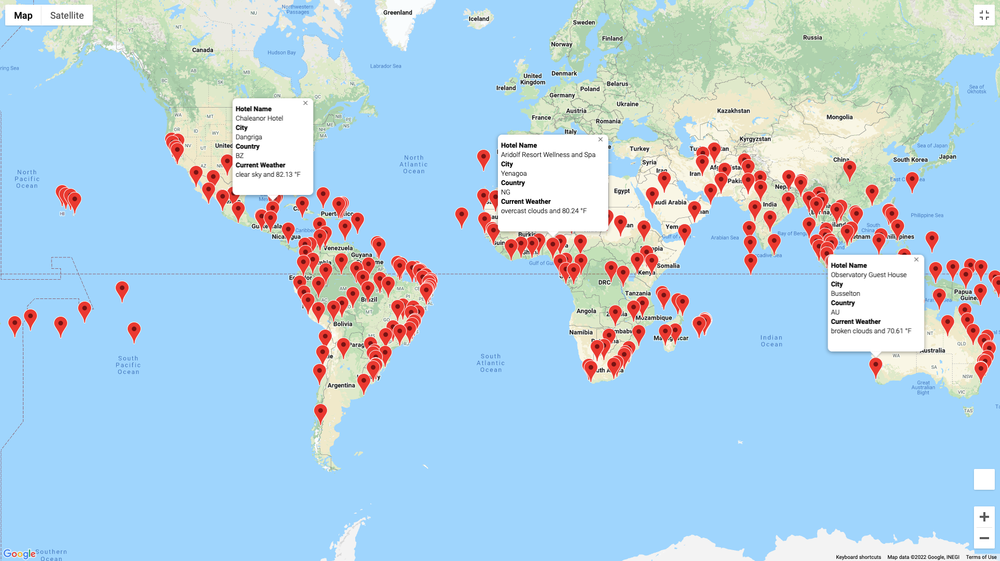

# World_Weather_Analysis

## Overview
The purpose of this project is to establish an APP called PlanMyTrip, which will collect and present data for customers via search page, which they will filer based on customers' preferred travel criteria in order to find their ideal hotel anywhere.

## Project Plan

1. Use the NumPy module to generate more than 2,000 random latitudes and longitudes.
2. Use the citipy module to list the nearest city to the latitudes and longitudes.
3. Use the OpenWeatherMap API to request the current weather data from each unique city in your list.
4. Parse the JSON data from the API request.
5. Collect the following data from the JSON file and add it to a DataFrame.
6. Export the data, clean it and use the weather data to choose the best cities for a vacation based on certain weather criteria, such as minimun weather and maximum weather preferred. It will be used to identify potential travel destinations and nearby hotels.
7. From the list of potential travel destinations, four cities will be chosen to create a travel itinerary. 
8. Finally, using the Google Maps Directions API, to create a travel route between the four cities as well as a marker layer map.

## Results

 

